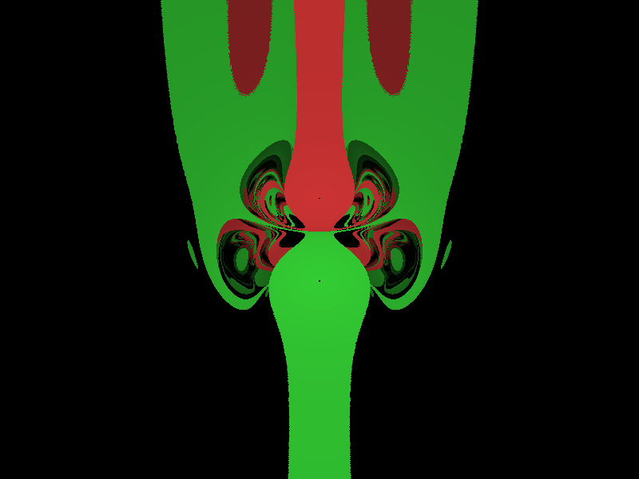

# Visualizing chaos

## The magnetic pendulum fractal:

The magnetic pendulum fractal is visualized by simulating a pendulum suspended above three magnets. When the pendulum is allowed to swing freely, it will eventually settle above one of the three magnets. In a fragment shader, the pendulum is dropped once at every pixel on the screen. The color of this pixel is then determined by which magnet the pendulum chooses. If a pendulum takes longer to settle, the respective pixel will have a darker colour.

An infinitely small change in where the pendulum is dropped, may result in vastly different paths. This is what gives the simulation its chaotic nature and mesmerizing appearance.

What makes this simulation exciting in particular is how the magnets can be moved in *real time*. By using the **mouse to click and drag the spheres**, anyone can bend and deform the fractal. 
 
 

## A few happy little accidents made along the way

### Fireworks:

### Mushrooms:

### The goblin:
